# Security Architecture and Vulnerability Analysis

## 1. Introduction: Security Philosophy

This document describes the defensive architecture of the Spotify Clone application and the results of a static vulnerability analysis. The goal is to explain:

- how the system is protected (architecture and controls)
- which tools were used to identify weaknesses
- which issues were detected and how they could be exploited
- how to remediate and prevent such issues in the future.

Our approach is **security-first**: we assume a hostile environment and design controls to protect confidentiality, integrity, and availability of user data and system resources.

**Guiding principles:**

- **Defense in depth** — multiple layers (reverse proxy, application middleware, service logic) enforce security so that a single failure does not compromise the system.
- **Least privilege** — users and services receive only the minimum access required; sensitive operations are restricted by role.
- **Secure by default** — all client–server communication is over HTTPS; authentication is required for protected resources; input is validated and output is encoded.
- **Observability-ready** — the architecture is prepared for centralized logging and monitoring to support detection and response.

---

## 2. Core Security Pillars

| Pillar | Objective | Primary Controls |
|--------|-----------|------------------|
| **Authentication** | Verify identity before granting access | HTTPS, JWT, BCrypt hashing and salting, password policy, token validation at gateway and services |
| **Authorization** | Enforce what authenticated entities may do | Role-Based Access Control (RBAC), mandatory auth checks per request, admin-only endpoints |
| **Availability** | Resist abuse and maintain service uptime | Multi-layer rate limiting, connection limits, request size limits, DoS mitigation at proxy and app |

These pillars are implemented at the edge (Nginx), in application middleware (Go/Gin), and in service logic, ensuring consistent enforcement across the system.

---

## 3. Detailed Control Breakdown

### 3.1 Authentication and Data Protection

**Encryption in transit**

- HTTPS is enforced for all client–server communication. Plain HTTP is redirected to HTTPS.
- TLS is restricted to TLSv1.2 and TLSv1.3; strong cipher suites (ECDHE, AES-GCM, ChaCha20-Poly1305) are used.
- HSTS is enabled to prevent downgrade attacks.
- Certificates are generated for development; production should use CA-signed certificates.

**Protection of credentials and sensitive data**

- Hashing and salting: user passwords are never stored in plaintext. We use BCrypt with a built-in salt and configurable cost factor.
- Password policy: minimum length, complexity, and rejection of common passwords reduce weak credentials.
- Password lifecycle: optional expiration and change timestamps support rotation and response to compromise.
- Password reset: time-limited, single-use tokens; reset links sent over email.
- Sensitive configuration (JWT secret, DB and SMTP credentials) is externalized via environment variables and not committed to version control.

Example password handling (conceptual):

```go
// Registration: hash with salt (BCrypt embeds salt automatically)
hashedPassword, err := bcrypt.GenerateFromPassword([]byte(req.Password), bcrypt.DefaultCost)

// Authentication: secure comparison
if err := bcrypt.CompareHashAndPassword([]byte(user.Password), []byte(password)); err != nil {
    return nil, errors.New("invalid credentials")
}
```

---

### 3.2 Access Control (RBAC)

Role-Based Access Control ensures that every protected request is checked for both identity and role.

- Roles (for example `user`, `admin`) are stored in the user store and embedded in the JWT as a `role` claim. The JWT is validated at the API gateway and/or at each service.
- Authorization is mandatory for protected routes: no endpoint serves sensitive data or actions without a valid token and, where required, the appropriate role.

**Enforcement points**

1. **Nginx** — for protected API paths, an `auth_request` subrequest validates the JWT with the user service. Only on success are `X-User-ID` and `X-User-Role` set and the request proxied to backends.
2. **Application middleware** — each service uses an `AuthMiddleware` that parses the `Authorization: Bearer <token>` header, validates the JWT (signature and claims), and sets `user_id` and `user_role` in the request context.
3. **Role checks** — sensitive operations (for example create/update content, admin-only storage) are protected by role middleware, which denies access if the role does not match.

Conceptual role enforcement:

```go
func RoleMiddleware(requiredRole string) gin.HandlerFunc {
    return func(c *gin.Context) {
        role, exists := c.Get("user_role")
        if !exists || role.(string) != requiredRole {
            c.AbortWithStatusJSON(http.StatusForbidden, gin.H{
                "error":         "insufficient permissions",
                "required_role": requiredRole,
            })
            return
        }
        c.Next()
    }
}
```

---

### 3.3 DoS Mitigation

Denial of Service is mitigated at two layers: reverse proxy and application.

**Proxy layer (Nginx)**

- Rate limiting via `limit_req_zone`: different zones for login, registration, and general API to throttle abuse and credential stuffing.
- Connection limiting (`limit_conn`) caps concurrent connections per client to prevent resource exhaustion.

**Application layer (Go services)**

- In-memory rate limiters (per client IP or per user ID when authenticated) limit requests per time window; exceeding the limit returns `429 Too Many Requests`.

---

### 3.4 Input Validation (XSS and Injection Mitigation)

We use strict server-side validation plus output encoding to neutralize injection and XSS risks.

- Whitelisting: input is validated against allowed character sets and lengths (for example username, email).
- Boundary checks: length and numeric range limits prevent buffer and resource abuse.
- Pattern-based detection: server-side checks for common SQL injection and XSS patterns; detected patterns are rejected.
- Sanitization / output encoding: before rendering or storing, strings are HTML-escaped so that even if malicious input is missed, it is not executed as script or markup.
- Content-Type and size: POST/PUT requests must use allowed content types; body size is capped.

Key security headers:

- `X-Content-Type-Options: nosniff`
- `X-Frame-Options: SAMEORIGIN` (or `DENY`)
- `X-XSS-Protection: 1; mode=block`

Example of sanitization and pattern checking:

```go
sanitized := html.EscapeString(input)
sanitized = strings.TrimSpace(sanitized)

if middleware.CheckXSSPatterns(sanitized) || middleware.CheckSQLInjectionPatterns(sanitized) {
    // reject or sanitize
}
```

---

### 3.5 Infrastructure and Environment Isolation

- **Microservices** — user, content, storage, notifications and subscriptions run as separate services; a compromise in one component is contained by network and authentication boundaries.
- **Reverse proxy** — Nginx is the single public entry point. It terminates TLS, enforces rate limits, and performs auth checks before forwarding; backends are not directly exposed.
- **Isolated runtime** — services run in containers (Docker); Compose defines isolated networks so that only required service-to-service communication is possible.

---

## 4. Threat Model (OWASP Top 10 Alignment)

We defend against the following high-level threats; controls are summarized in the table below.

| Threat / Risk | Mitigation |
|---------------|-----------|
| A01:2021 – Broken Access Control | RBAC, mandatory auth on every protected request, role middleware on admin and sensitive endpoints |
| A02:2021 – Cryptographic Failures | HTTPS only, TLS 1.2/1.3, strong ciphers, BCrypt for passwords, no plaintext credential storage |
| A03:2021 – Injection | Input validation, whitelisting, SQL/XSS pattern checks, parameterized DB access, output encoding |
| A04:2021 – Insecure Design | Defense in depth, least privilege, security headers, rate limiting, request size limits |
| A05:2021 – Security Misconfiguration | Security headers, TLS and HSTS, environment-based config, no default credentials in code |
| A06:2021 – Vulnerable Components | Dependency management (Go modules); keep dependencies updated |
| A07:2021 – Identification and Authentication Failures | Strong password policy, BCrypt, JWT validation, rate limiting on login/register/reset |
| A08:2021 – Software and Data Integrity | JWT signature verification, TLS for data in transit, integrity checks for file uploads where implemented |
| A09:2021 – Logging and Monitoring Failures | Architecture prepared for centralized logging; auth and rate-limit events are candidates for logging |
| A10:2021 – SSRF | Backend services not directly exposed; proxy and auth reduce SSRF impact; internal calls use service names |

---

## 5. Security Roadmap (Short Overview)

Planned or recommended improvements that further strengthen the security posture:

- **Centralized logging and monitoring**: aggregate logs from Nginx and all services into a central store (for example ELK, Loki, SIEM) to support detection, alerting and incident response.
- **Multi-Factor Authentication (MFA)**: introduce a second factor (for example TOTP or email OTP) for high-risk actions or for all logins to reduce the impact of credential theft.
- **Password hashing evolution**: evaluate Argon2 (for example Argon2id) as an alternative or complement to BCrypt for new passwords, in line with current best practices.

These items are complementary to the controls already described and can be implemented as future work.

---

## 6. Overall Security Summary

The Spotify Clone applies a defense-in-depth, security-first approach across authentication (HTTPS, BCrypt, JWT), authorization (RBAC on every protected request), availability (rate limiting and DoS controls), and input validation (whitelisting, sanitization, XSS/SQL pattern checks). The system is built as a distributed, environment-isolated set of services behind a hardened reverse proxy, with a threat model aligned to OWASP Top 10 and a clear direction for further improvements.

---

## 7. Vulnerability Analysis

Requirement 2.21 asks for a report on the application security level:

1. which tools were used to identify vulnerabilities  
2. which vulnerabilities were identified and how they can potentially be exploited  
3. how to remediate the identified vulnerabilities  
4. how to protect against their exploitation  

### 7.1 Tool Used to Identify Vulnerabilities

- **SonarQube (Community Edition)** — static code and quality analysis, run locally via Docker.  
  It analyzes: vulnerabilities (Security), bugs (Reliability), code smells (Maintainability), test coverage (Coverage), and duplications (Duplications).  
  Each Go microservice was scanned as a separate project.

How to reproduce scans (locally):

- Start SonarQube: `docker-compose up -d sonarqube-db sonarqube` and open `http://localhost:9001`.
- Create a token: My Account → Security → Generate Token.
- Analyze a single service:  
  `.\scripts\sonarqube-scan.ps1 -ServiceName <service-name> -Token "<TOKEN>"`
- Analyze all services:  
  `.\scripts\sonarqube-scan-all.ps1 -Token "<TOKEN>"`

---

### 7.2 Results by Service (Summary)

SonarQube analyzed 5 Go microservices: `content-service`, `user-service`, `notifications-service`, `storage-service`, `subscriptions-service`.

| Service | Quality Gate | Security | Reliability | Maintainability issues (High) | Coverage | Duplications | Security Hotspots |
|--------|--------------|----------|------------|-------------------------------|----------|--------------|------------------|
| content-service | Failed (new code) | 0 (A) | 0 (A) | 4 | 0.0% | 4.25% (new code) | 0 |
| user-service | Passed (with warning) | 0 (A) | 0 (A) | 6 | 0.0% | 2.9% (handler: 17.1%) | 0 |
| notifications-service | Passed (with warning) | 0 (A) | 0 (A) | 1 | 0.0% | 0.0% | 0 |
| storage-service | Passed (with warning) | 0 (A) | 0 (A) | 7 | 0.0% | 0.0% | 0 |
| subscriptions-service | Passed (with warning) | 0 (A) | 0 (A) | 2 | 0.0% | 0.0% | 0 |

Key conclusions from the table:

- No **Security vulnerabilities** or **Reliability bugs** were detected (all services have an A grade).
- A total of **20 Maintainability issues (High)** were identified — mostly duplicated literals and high function complexity.
- Code coverage is **0.0%** for all services, which means there are no automated tests that cover critical paths.
- Duplications are generally low, but content-service and user-service have elevated duplication percentages for new code, especially in handler layers.

---

### 7.3 Identified Weaknesses and Potential Exploitation

SonarQube did not report direct Vulnerability-type issues, but it identified maintainability problems that can indirectly lead to security flaws if ignored.

**1. Duplicated literals (17 issues)**

- Affect validation and security messages (for example `"invalid or potentially malicious input detected"`, `"user not authenticated"`, `"user not found"`), HTTP headers (`"Content-Type"`, `"Content-Length"`, `"Accept-Ranges"`, `"X-User-ID"`) and error messages (`"track not found: %s"`, `"failed to stat file: %w"`, `"failed to decode subscriptions: %w"`).
- Potential exploitation:
  - Inconsistent application of validation and authentication if a message or logic is changed in one place but not in others;
  - Information leakage through different error messages (revealing whether a resource exists, whether the problem is in the DB, decoding, and similar);
  - HTTP response configuration errors (for example incorrect `Content-Type`) that can facilitate XSS or other attacks.

**2. High Cognitive Complexity in user-service (4 issues)**

- Complex functions in handlers, middleware and service layer make understanding and code review harder.
- Potential exploitation:
  - Logical errors in authentication and authorization that go unnoticed;
  - Edge-case scenarios (for example specific combinations of headers or user states) that are not covered by tests and may bypass security checks.

**3. Low coverage and code duplication**

- Without tests, regressions and security issues can go unnoticed during refactoring.
- Duplicated code increases the probability that the same bug or vulnerability appears in multiple places and makes it harder to fix.

---

### 7.4 How to Address the Identified Weaknesses

Recommended technical measures to remediate the observed issues:

**1. Constants instead of duplicated literals**

- Introduce clear constants for all repeated strings (error messages, security messages, header names, MIME types).
- Example (generic):

```go
const (
    ErrInvalidMaliciousInput = "invalid or potentially malicious input detected"
    ErrUserNotAuthenticated  = "user not authenticated"
    HeaderContentType        = "Content-Type"
)
```

- Replace all duplicated literals with the corresponding constants in all services and rerun the SonarQube scan.

**2. Reducing cognitive complexity**

- Split long functions into smaller logical units (for example validation, data processing, response generation).
- In auth middleware, extract token parsing, validation and role checks into separate functions.
- Refactor complex functions in `user-service` so that complexity stays within SonarQube’s recommended threshold.

**3. Introducing automated tests and increasing coverage**

- Add unit tests for:
  - authentication and authorization (user-service, subscriptions-service);
  - input validation and filtering (content-service, notifications-service);
  - upload/download and file handling (storage-service).
- Add integration tests for key API endpoints and DB interactions.
- Set a coverage target (for example 80%) and include it in the SonarQube Quality Gate.

**4. Reducing code duplication**

- In `content-service` and `user-service`, extract repeated handler logic into helper functions or shared modules.
- Regularly monitor the Duplications metric per directory and refactor when values exceed the agreed threshold.

---

### 7.5 How to Protect Against Exploitation (Process and Practices)

Besides fixing the current issues, it is important to set up a process that prevents similar weaknesses from reappearing.

**1. Regular static analysis**

- Require that a SonarQube scan is run for every larger commit or before merging branches.
- Monitor the Quality Gate; if it fails due to new Security, Reliability or High Maintainability issues, changes must not be merged until problems are fixed.

**2. Security-focused code review**

- Include in review checklists:
  - no new duplicated literals for security messages and headers;
  - complex functions are broken down into smaller units;
  - new code comes with appropriate tests.

**3. Logging and monitoring**

- Centralize logs from all services and the proxy layer.
- Log:
  - failed authentication and authorization attempts,
  - rejected requests due to malicious input,
  - rate limit violations.
- Configure alerts for unusual patterns, such as a high number of failed logins or repeated malicious input.

**4. Continuous improvement**

- Periodically (for example quarterly) review SonarQube reports and focus on reducing the number of High severity issues.
- Update coding policies and standards based on findings (for example introduce a rule that all messages and headers are defined via constants).

In this way, requirement 2.21 is fulfilled: the analysis tool is clearly specified, concrete weaknesses and their potential impact are identified, and both technical and process measures are defined to remediate and prevent exploitation.

---

# Security Architecture

## 1. Introduction: Security Philosophy

This document describes the **defensive architecture** of the Spotify Clone application from a Blue Team perspective. Our approach is **security-first**: we assume a hostile environment and design controls to protect confidentiality, integrity, and availability of user data and system resources.

**Guiding principles:**

- **Defense in depth** — Multiple layers (reverse proxy, application middleware, service logic) enforce security so that a single failure does not compromise the system.
- **Least privilege** — Users and services receive only the minimum access required; sensitive operations are restricted by role.
- **Secure by default** — All client–server communication is over HTTPS; authentication is required for protected resources; input is validated and output is encoded.
- **Observability-ready** — The architecture is prepared for centralized logging and monitoring to support detection and response (see Roadmap).

The controls below map to common threat models (including OWASP Top 10) and are implemented across a **distributed, microservice-based** stack with clear trust boundaries.

---

## 2. Core Security Pillars

| Pillar | Objective | Primary Controls |
|--------|-----------|------------------|
| **Authentication** | Verify identity before granting access | HTTPS, JWT, BCrypt hashing & salting, password policy, token validation at gateway and services |
| **Authorization** | Enforce what authenticated entities may do | Role-Based Access Control (RBAC), mandatory auth checks per request, admin-only endpoints |
| **Availability** | Resist abuse and maintain service uptime | Multi-layer rate limiting, connection limits, request size limits, DoS mitigation at proxy and app |

These pillars are implemented at the **edge (Nginx)**, in **application middleware (Go/Gin)**, and in **service logic**, ensuring consistent enforcement across the system.

---

## 3. Detailed Control Breakdown

### 3.1 Authentication & Data Protection

**Encryption in transit**

- **HTTPS** is enforced for all client–server communication. Plain HTTP is redirected to HTTPS (for example `301` to `https://$host:8443$request_uri`).
- TLS is restricted to **TLSv1.2** and **TLSv1.3**; strong cipher suites (for example ECDHE, AES-GCM, ChaCha20-Poly1305) are used.
- **HSTS** is enabled (`Strict-Transport-Security: max-age=31536000; includeSubDomains`) to prevent downgrade attacks.
- SSL certificates and Diffie–Hellman parameters are generated for development; production should use CA-signed certificates.

**Protection of credentials and sensitive data**

- **Hashing & salting**: User passwords are never stored in plaintext. We use **BCrypt** with a built-in salt and configurable cost factor. BCrypt is industry-standard for password hashing and provides resistance to rainbow-table and brute-force attacks.

*Logic (conceptual):* Passwords are hashed at registration and password reset; verification uses constant-time comparison (`CompareHashAndPassword`) to reduce timing side channels.

```go
// Registration: hash with salt (BCrypt embeds salt automatically)
hashedPassword, err := bcrypt.GenerateFromPassword([]byte(req.Password), bcrypt.DefaultCost)

// Authentication: secure comparison
if err := bcrypt.CompareHashAndPassword([]byte(user.Password), []byte(password)); err != nil {
    return nil, errors.New("invalid credentials")
}
```

- **Password policy**: Enforced server-side (for example minimum length, complexity, rejection of common passwords, consecutive character rules) to reduce weak credentials.
- **Password lifecycle**: Optional password expiration and change timestamps support rotation and response to compromise.
- **Password reset**: Time-limited, single-use tokens; reset links sent over email with clear user guidance.

Sensitive configuration (for example JWT secret, DB and SMTP credentials) is externalized via environment variables and not committed to version control.

---

### 3.2 Access Control (RBAC)

**Role-Based Access Control** ensures that every protected request is checked for both **identity** and **role**.

- **Roles** (for example `user`, `admin`) are stored in the user store and embedded in the **JWT** (for example `role` claim). The JWT is validated at the API gateway and/or at each service.
- **Authorization** is mandatory for protected routes: no endpoint serves sensitive data or actions without a valid token and, where required, the appropriate role.

**Enforcement points**

1. **Nginx** — For protected API paths, an `auth_request` subrequest validates the JWT with the user service. Only on success are `X-User-ID` and `X-User-Role` set and the request proxied to backends.
2. **Application middleware** — Each service uses an `AuthMiddleware` that parses the `Authorization: Bearer <token>` header, validates the JWT (signature and claims), and sets `user_id` and `user_role` in the request context.
3. **Role checks** — Sensitive operations (for example create/update content, admin-only storage) are protected by `RoleMiddleware` or `AdminOnly()`, which deny access if the role does not match.

*Logic (conceptual):* After JWT validation, the role is read from claims and compared to the required role for the handler; a mismatch results in `403 Forbidden`.

```go
// Role enforcement: every protected admin action requires explicit check
func RoleMiddleware(requiredRole string) gin.HandlerFunc {
    return func(c *gin.Context) {
        role, exists := c.Get("user_role")
        if !exists || role.(string) != requiredRole {
            c.AbortWithStatusJSON(http.StatusForbidden, gin.H{
                "error": "insufficient permissions",
                "required_role": requiredRole,
            })
            return
        }
        c.Next()
    }
}
```

This design preserves **system integrity** by ensuring that only authorized roles can modify content, manage users, or access administrative functions.

---

### 3.3 DoS Mitigation

**Denial of Service** is mitigated at two layers: **reverse proxy** and **application**.

**Proxy layer (Nginx)**

- **Rate limiting** via `limit_req_zone`: different zones for login (for example 5 req/min), registration (for example 3 req/min), and general API (for example 50–100 req/s) to throttle abuse and credential stuffing.
- **Connection limiting** (`limit_conn`) caps concurrent connections per client (for example 10) to prevent resource exhaustion.
- **Burst** and `nodelay` are used to allow short spikes while enforcing sustained limits.

**Application layer (Go services)**

- **In-memory rate limiters** (per client IP or per user ID when authenticated) limit requests per time window (for example 100/min general, 5/min for login/register/password-reset). Exceeding the limit returns `429 Too Many Requests`.

*Logic (conceptual):* A sliding or fixed window counts requests per identifier; when the count exceeds the limit within the window, the request is rejected and a cleanup routine evicts expired entries.

```go
// Rate limiter: allow(identifier) checks count in window; reject if >= limit
if req.count >= rl.limit {
    return false
}
req.count++
return true
```

Together, these controls reduce the impact of volumetric and application-layer DoS attempts while preserving legitimate traffic.

---

### 3.4 Input Validation (XSS & SQL Injection Mitigation)

We use **strict client-side and server-side validation** plus **output encoding** to neutralize injection and XSS risks.

**Strategy**

- **Whitelisting** — Input is validated against allowed character sets and lengths (for example username: alphanumeric, underscore, hyphen; name: letters, spaces, hyphens, apostrophes; email: RFC-style format). Invalid input is rejected early.
- **Boundary checks** — Length and numeric range limits (for example username 3–30 characters, body size 10 MB) prevent buffer and resource abuse.
- **Pattern-based detection** — Server-side checks for common **SQL injection** patterns (for example `UNION SELECT`, `'; --`, `OR 1=1`) and **XSS** patterns (for example `<script>`, `javascript:`, `onerror=`, `eval(`). Detected patterns result in rejection or sanitization.
- **Sanitization / output encoding** — Before rendering or storing, strings are HTML-escaped (`html.EscapeString`) so that even if malicious input is missed, it is not executed as script or markup.
- **Content-Type and size** — POST/PUT requests must use allowed content types (for example `application/json`, `multipart/form-data`); body size is capped.

**Security headers** (Nginx and/or application) reinforce browser behavior:

- `X-Content-Type-Options: nosniff`
- `X-Frame-Options: SAMEORIGIN` or `DENY`
- `X-XSS-Protection: 1; mode=block`

*Logic (conceptual):* Validation runs in middleware and in handlers; sanitization is applied before persistence or response. The content service applies XSS/SQL pattern checks on sanitized input before accepting content updates.

```go
// Sanitization: escape before storage/display
sanitized := html.EscapeString(input)
sanitized = strings.TrimSpace(sanitized)

// Injection pattern check (for example in content handler)
if middleware.CheckXSSPatterns(sanitized) || middleware.CheckSQLInjectionPatterns(sanitized) {
    // Reject or sanitize
}
```

Note: We use MongoDB and parameterized access; the SQL injection checks add defense in depth and protect against NoSQL-style injection where applicable.

---

### 3.5 Infrastructure & Environment Isolation

**Secure, distributed design**

- **Microservices** — User, content, storage, and notifications run as separate services. A compromise in one component is contained by network and authentication boundaries.
- **Reverse proxy** — Nginx is the single public entry point. It terminates TLS, enforces rate limits, and performs `auth_request` before forwarding; backends are not directly exposed.
- **Isolated runtime** — Services run in **containers** (Docker); orchestration (for example Docker Compose) defines isolated networks so that only required service-to-service communication is possible.

This structure supports **secure deployment** and future hardening (for example secrets management, network policies).

---

## 4. Threat Model (OWASP Top 10 Alignment)

We defend against the following high-level threats; controls are summarized in the table below.

| Threat / Risk | Mitigation |
|---------------|------------|
| **A01:2021 – Broken Access Control** | RBAC, mandatory auth on every protected request, role middleware on admin and sensitive endpoints |
| **A02:2021 – Cryptographic Failures** | HTTPS only, TLS 1.2/1.3, strong ciphers, BCrypt for passwords, no plaintext credential storage |
| **A03:2021 – Injection** | Input validation, whitelisting, SQL/XSS pattern checks, parameterized DB access, output encoding |
| **A04:2021 – Insecure Design** | Defense in depth, least privilege, security headers, rate limiting, request size limits |
| **A05:2021 – Security Misconfiguration** | Security headers, TLS and HSTS, environment-based config, no default credentials in code |
| **A06:2021 – Vulnerable Components** | Dependency management (Go modules); keep dependencies updated (process not detailed here) |
| **A07:2021 – Identification and Authentication Failures** | Strong password policy, BCrypt, JWT validation, rate limiting on login/register/reset |
| **A08:2021 – Software and Data Integrity** | JWT signature verification, TLS for data in transit, integrity via hashing of uploads where implemented |
| **A09:2021 – Logging and Monitoring Failures** | Architecture prepared for centralized logging (see Roadmap); auth and rate-limit events are candidates for logging |
| **A10:2021 – SSRF** | Backend services not directly exposed; proxy and auth reduce SSRF impact; internal calls use service names |

---

## 5. Summary

The Spotify Clone applies a **defense-in-depth**, **security-first** approach across authentication (HTTPS, BCrypt, JWT), authorization (RBAC on every protected request), availability (rate limiting and DoS controls), and input validation (whitelisting, sanitization, XSS/SQL pattern checks). The system is built as a **distributed, environment-isolated** set of services behind a hardened reverse proxy, with a clear **threat model** aligned to OWASP Top 10 and a **security roadmap** focused on centralized logging/monitoring and MFA.

---

## 6. Vulnerability Analysis (Requirement 2.21)

The application security report covers:

1. **Which tools were used** to identify vulnerabilities  
2. **Which vulnerabilities were identified** and how they can potentially be exploited  
3. **How to remediate** the identified vulnerabilities  
4. **How to protect** against their exploitation  

---

### 6.1 Tools Used to Identify Vulnerabilities

- **SonarQube (Community Edition)** — static code and quality analysis, run locally via Docker.  
  It analyzes: vulnerabilities (Security), bugs (Reliability), code smells (Maintainability), test coverage (Coverage), duplications (Duplications).  
  Each Go microservice is scanned as a separate project in SonarQube.

**How to reproduce scans:**  
Start SonarQube: `docker-compose up -d sonarqube-db sonarqube`. Open `http://localhost:9001`, create a token (My Account → Security → Generate Token).  
Single service: `.\scripts\sonarqube-scan.ps1 -ServiceName <service-name> -Token "TOKEN"`.  
All services: `.\scripts\sonarqube-scan-all.ps1 -Token "TOKEN"`.  
Projects: `http://localhost:9001/projects`; single project: `http://localhost:9001/dashboard?id=spotify-*service-name*`.

---

### 6.2 Results by Service — What to Capture in Screenshots (Step by Step)

For each service we capture the same set of screenshots; based on them we construct the text: identified vulnerabilities, how they can be exploited, how to remediate, how to protect.

---

#### Service 1: **content-service**

**Dashboard:** `http://localhost:9001/dashboard?id=spotify-content-service`

**Screenshot 1 — Overview (project summary)**

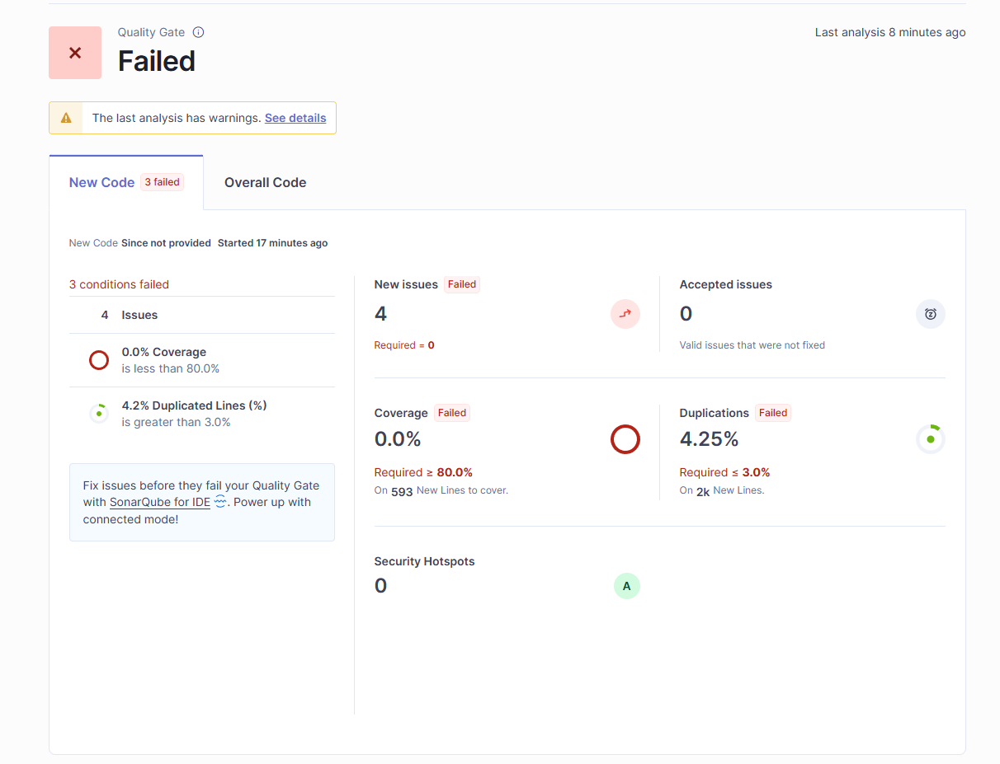

**Summary:** Quality Gate **Failed** for "New Code". Found: **4 issues**, **0.0% Coverage** (below the required 80%), **4.25% Duplications** (above the required 3%). Security: 0 issues (A), Reliability: 0 issues (A), Maintainability: 4 issues (A). Lines of Code: 1.7k.

---

**Screenshot 2 — Issues (identified weaknesses/problems)**

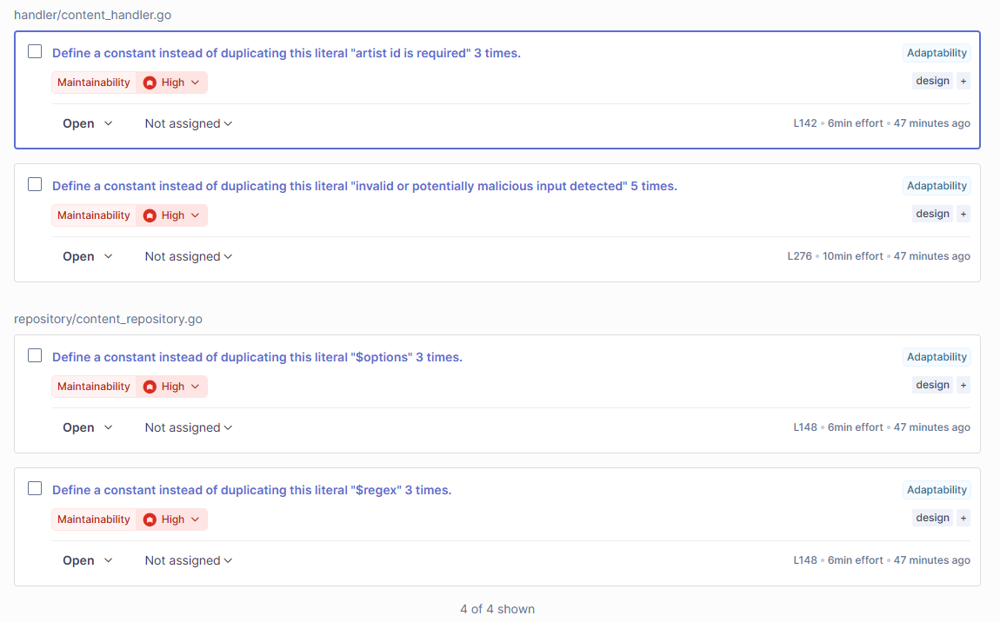

**Identified weaknesses/problems:**

1. **`handler/content_handler.go:142`** — Duplicated literal `'artist id is required'` (3 times). Maintainability, High.
2. **`handler/content_handler.go:276`** — Duplicated literal `'invalid or potentially malicious input detected'` (5 times). Maintainability, High.
3. **`repository/content_repository.go:148`** — Duplicated literal `'$options'` (3 times). Maintainability, High.
4. **`repository/content_repository.go:148`** — Duplicated literal `'$regex'` (3 times). Maintainability, High.

**How they can potentially be exploited:**

- Duplicated literals increase the risk of mistakes during changes: if a message is changed in one place but not the others, messages can become inconsistent and behavior confusing.
- This is especially important for `'invalid or potentially malicious input detected'`: if the message or associated logic is changed or removed in one place, validation may become inconsistent and allow malicious input to pass.
- Higher likelihood of typos in duplicated strings, which can lead to unexpected behavior or skipped validation.

**How to remediate:**

- Define constants for all duplicated literals:

```go
// In handler/content_handler.go
const (
    ErrArtistIDRequired = "artist id is required"
    ErrInvalidInput     = "invalid or potentially malicious input detected"
)

// In repository/content_repository.go
const (
    MongoOptionKey = "$options"
    MongoRegexKey  = "$regex"
)
```

- Replace all occurrences of duplicated literals with constants.
- After the change, rerun the SonarQube scan to confirm that the issues are resolved.

**How to protect against exploitation:**

- Run SonarQube scans regularly (for example before each merge) to detect new duplications.
- Track the Quality Gate: if it fails due to duplications, block the merge until they are fixed.
- During code review, check that constants are used instead of duplicated literals, especially for validation and security messages.
- Automation: integrate SonarQube into the CI/CD pipeline so that the Quality Gate is checked automatically.

---

**Screenshot 3 — Security Hotspots**

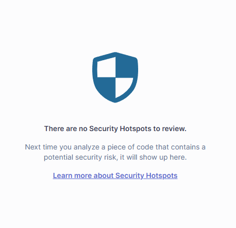

**Summary:** **0 Security Hotspots** — no locations requiring manual review from a security perspective.

---

**Screenshot 4 — Duplications**

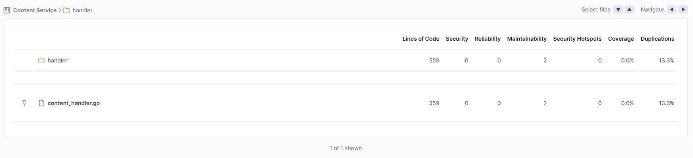

**Summary:** In the `handler` directory (`content_handler.go`): **13.3% duplication** (559 lines of code). Duplications are related to the issues from Screenshot 2 (duplicated literals).

**How to remediate:** Refactor code to remove duplications — extract common parts into functions or constants (see Screenshot 2 recommendations).

**How to protect:** Regularly monitor the Duplications metric in SonarQube; the Quality Gate requires ≤ 3% duplication, current value is 4.25% for "New Code", which is the reason for the Failed status.

---

**Overall summary for content-service:**

- **Security:** 0 issues (A) — no direct vulnerabilities.
- **Reliability:** 0 issues (A) — no bugs.
- **Maintainability:** 4 issues (High) — duplicated literals in handler and repository layers.
- **Coverage:** 0.0% — no tests; Quality Gate requires ≥ 80%.
- **Duplications:** 4.25% (New Code) — above the required 3%.

**Main reason for Quality Gate Failed:** Low coverage (0% vs required 80%) and high duplication percentage (4.25% vs required 3%).

---

#### Service 2: **user-service**

**Dashboard:** `http://localhost:9001/dashboard?id=spotify-user-service`

**Screenshot 1 — Overview (project summary)**

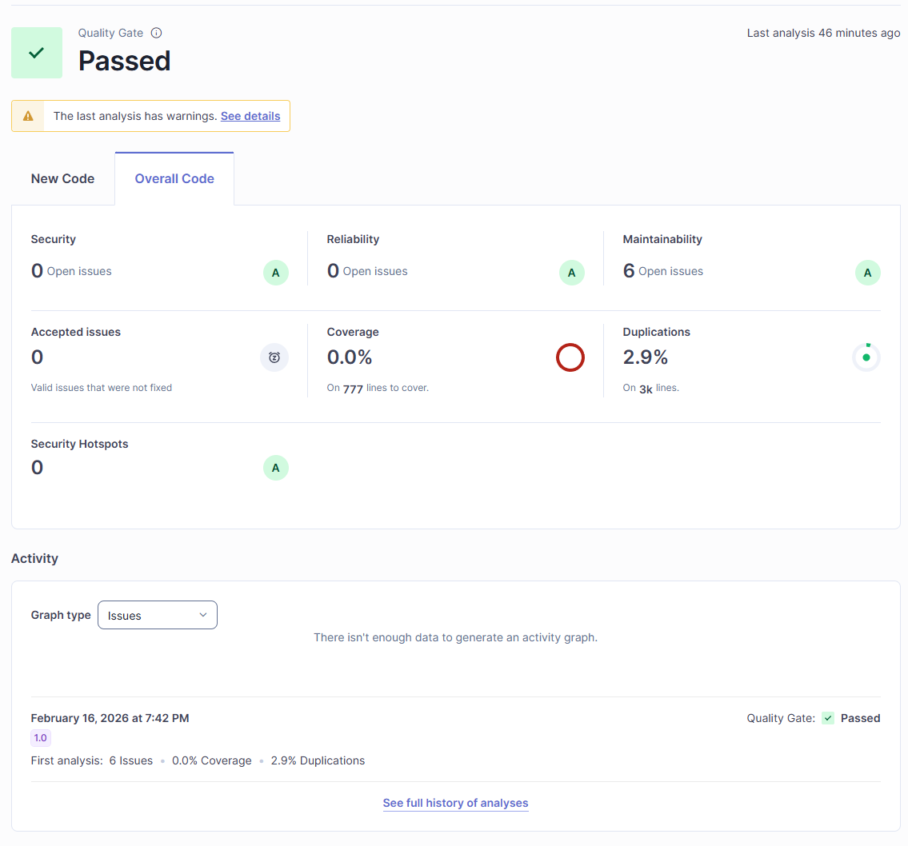

**Summary:** Quality Gate **Passed** (with warning "The last analysis has warnings"). Found: **6 issues** (all Maintainability). Security: 0 issues (A), Reliability: 0 issues (A), Maintainability: 6 issues (A). Coverage: 0.0% (777 lines uncovered), Duplications: 2.9% (3k lines). Lines of Code: 2.4k.

---

**Screenshot 2 — Issues (identified weaknesses/problems)**

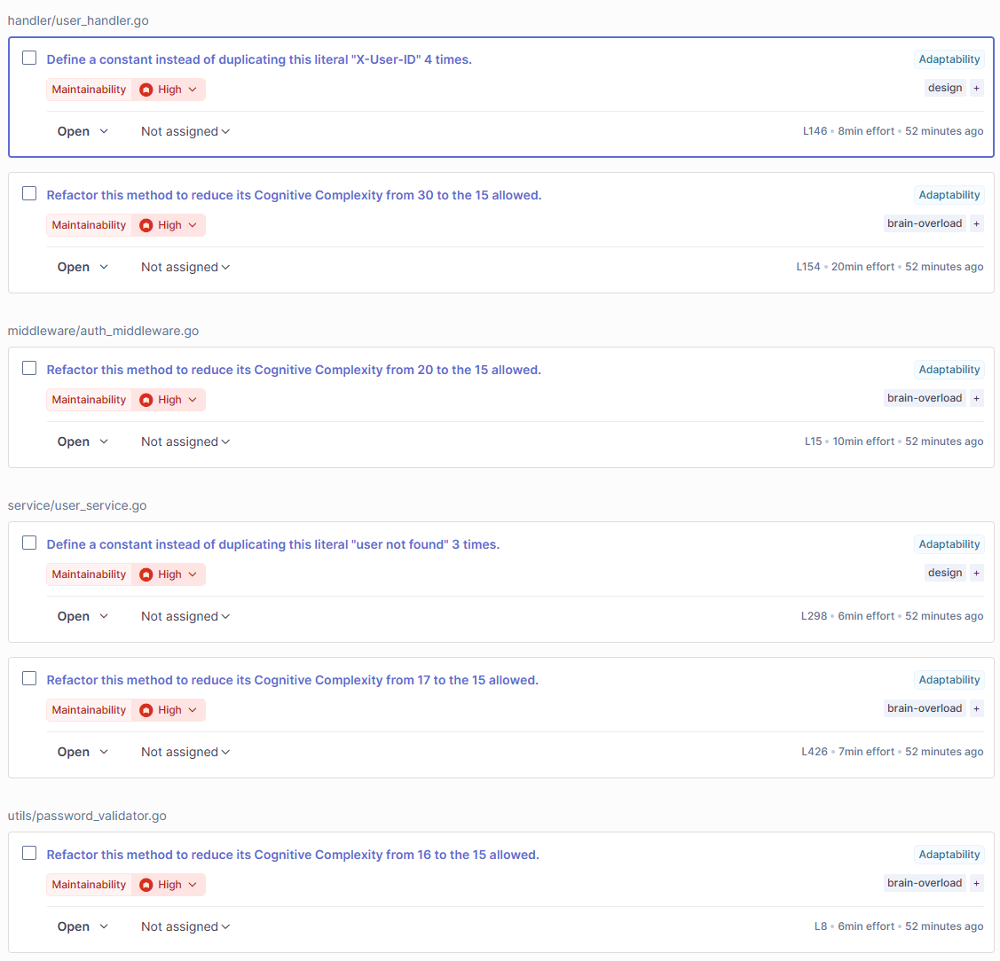

**Identified weaknesses/problems:**

1. **`handler/user_handler.go:146`** — Duplicated literal `'X-User-ID'` (4 times). Maintainability, High.
2. **`handler/user_handler.go:154`** — Cognitive Complexity 30 (allowed 15). Maintainability, High.
3. **`middleware/auth_middleware.go:15`** — Cognitive Complexity 20 (allowed 15). Maintainability, High.
4. **`service/user_service.go:298`** — Duplicated literal `'user not found'` (3 times). Maintainability, High.
5. **`service/user_service.go:426`** — Cognitive Complexity 17 (allowed 15). Maintainability, High.
6. **`utils/password_validator.go:8`** — Cognitive Complexity 16 (allowed 15). Maintainability, High.

**How they can potentially be exploited:**

- **Duplicated literals (`'X-User-ID'`, `'user not found'`):** Same risk as in content-service — inconsistency during changes can lead to authentication/authorization errors. Especially critical for `'X-User-ID'` because it is used in middleware for identity checks; if the header changes in one place but not in another, authorization can be bypassed.
- **High Cognitive Complexity (30, 20, 17, 16):** Complex functions are harder to understand and maintain, increasing the probability of errors. In `user_handler.go:154` (Complexity 30) and `auth_middleware.go:15` (Complexity 20) — critical authentication locations — high complexity can hide logic errors that an attacker could exploit (for example missing checks, incorrect authorization logic).
- **Inconsistent error messages (`'user not found'`):** If the message is changed in one place, it can lead to confusion during debugging or to information leakage (different messages may reveal whether a user exists).

**How to remediate:**

- **Duplicated literals:**

```go
// In handler/user_handler.go
const HeaderUserID = "X-User-ID"

// In service/user_service.go
const ErrUserNotFound = "user not found"
```

Replace all occurrences with constants.

- **Cognitive Complexity:**
  - **`user_handler.go:154` (Complexity 30):** Split the function into smaller functions (for example extract validation, data processing, and response generation).
  - **`auth_middleware.go:15` (Complexity 20):** Simplify the authentication logic — extract token parsing, validation and context setting into separate functions.
  - **`user_service.go:426` (Complexity 17) and `password_validator.go:8` (Complexity 16):** Refactor into smaller functions with clear responsibilities.

**How to protect against exploitation:**

- Run SonarQube scans regularly and monitor the Cognitive Complexity metric — functions with Complexity > 15 are risky in critical parts (auth, validation).
- Focus code review on authentication/authorization — especially `auth_middleware.go` and `user_handler.go` due to high complexity.
- Add unit tests for complex functions (especially auth middleware) to cover different scenarios and reduce the risk of logic errors.
- Refactor before merging — block merges if Cognitive Complexity exceeds the (for example 15) threshold for critical functions.

---

**Screenshot 3 — Security Hotspots**

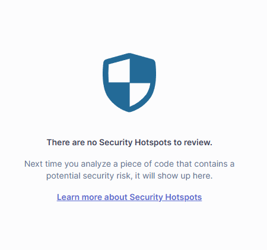

**Summary:** **0 Security Hotspots** — no locations requiring manual review from a security perspective.

---

**Screenshot 4 — Duplications**

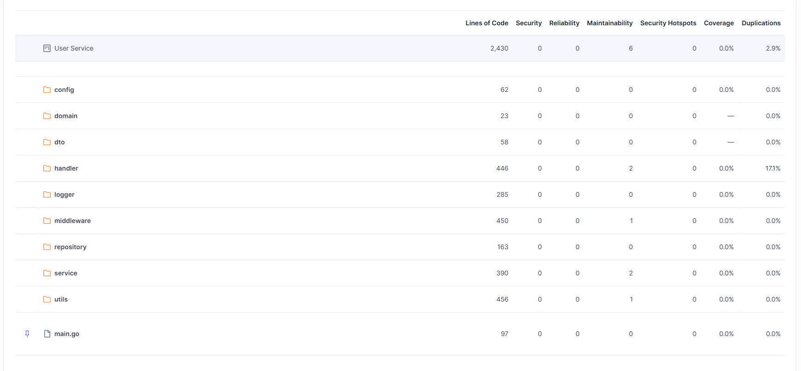

**Summary:** Total **2.9% duplication** (3k lines). The **`handler` directory has 17.1% duplication** (446 lines) — the highest percentage in the service. Other directories have 0% duplication.

**How to remediate:** Refactor the `handler` directory — extract common parts into helper functions or middleware. Duplicated literals (see Issues) are part of the problem.

**How to protect:** Monitor the Duplications metric per directory; the `handler` directory at 17.1% is critical — refactor before it grows further.

---

**Overall summary for user-service:**

- **Security:** 0 issues (A) — no direct vulnerabilities.
- **Reliability:** 0 issues (A) — no bugs.
- **Maintainability:** 6 issues (High) — 2 duplicated literals, 4 functions with high Cognitive Complexity.
- **Coverage:** 0.0% — no tests; Quality Gate requires ≥ 80%.
- **Duplications:** 2.9% overall (Passed), but the `handler` directory has 17.1% (critical).

**Main reason for Quality Gate Passed (with warning):** Low coverage (0% vs required 80%) and high Cognitive Complexity in critical functions (auth, handler) represent a risk for maintainability and security.

---

#### Service 3: **notifications-service**

**Dashboard:** `http://localhost:9001/dashboard?id=spotify-notifications-service`

**Screenshot 1 — Overview (project summary)**

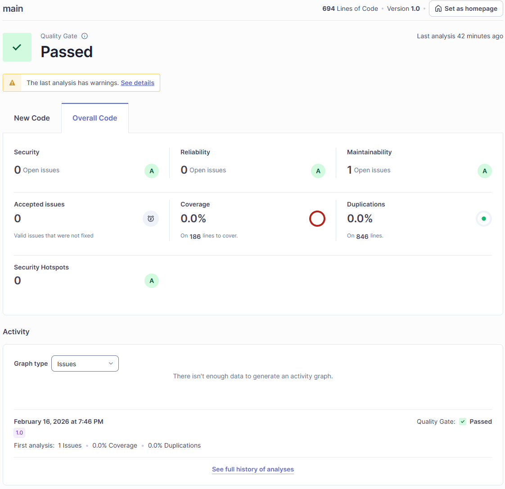

**Summary:** Quality Gate **Passed** (with warning "The last analysis has warnings"). Found: **1 issue** (Maintainability). Security: 0 issues (A), Reliability: 0 issues (A), Maintainability: 1 issue (A). Coverage: 0.0% (186 lines uncovered), Duplications: 0.0%. Lines of Code: 694.

---

**Screenshot 2 — Issues (identified weaknesses/problems)**

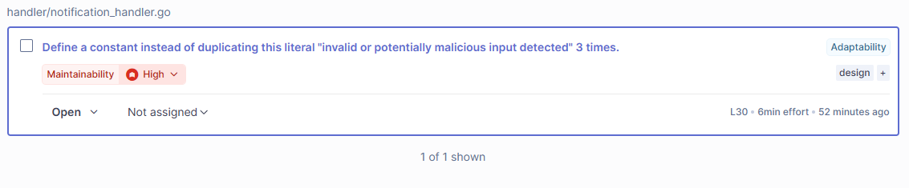

**Identified weaknesses/problems:**

1. **`handler/notification_handler.go:30`** — Duplicated literal `"invalid or potentially malicious input detected"` (3 times). Maintainability, High.

**How it can potentially be exploited:**

- **Duplicated security error literal (`"invalid or potentially malicious input detected"`):** This message is directly tied to detection of malicious input. If the message or logic associated with it is changed in one place but not in others, input validation can become inconsistent. An attacker can use different instances of this message to infer where validation is applied and try to bypass protection on some endpoints. Also, inconsistent messages can hide different attack types (for example SQL injection vs XSS vs path traversal), making incident response harder and potentially concealing specific security problems. If one instance is updated with better validation and others are not, the attacker can bypass protection through the outdated instances.

**How to remediate:**

- **Define a constant for the security error message:**

```go
// In handler/notification_handler.go or in a dedicated security/constants.go
const ErrInvalidMaliciousInput = "invalid or potentially malicious input detected"
```

- Replace all duplicated literals with the constant.
- Consider creating a centralized security error handling module that uses the constant and provides consistent logging and responses for all malicious input cases.
- After the change, rerun the SonarQube scan to confirm the issue is resolved.

**How to protect against exploitation:**

- Run SonarQube scans regularly to detect new duplications, especially in handler layers that are critical for input validation and security.
- Focus code review on input validation — check that constants are used instead of duplicated literals for security error messages.
- Centralize security error handling — create a module that manages all security error messages and logging instead of duplicating literals.
- Test various malicious input scenarios (SQL injection, XSS, path traversal, etc.) to confirm that messages are consistent on all endpoints.
- Monitor the Quality Gate — even though it is Passed, the warning points to issues that should be fixed.

---

**Screenshot 3 — Security Hotspots**

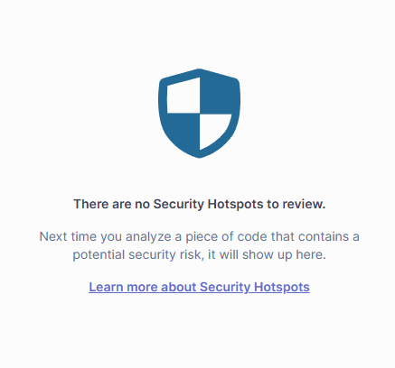

**Summary:** **0 Security Hotspots** — no locations requiring manual review from a security perspective.

---

**Screenshot 4 — Duplications**

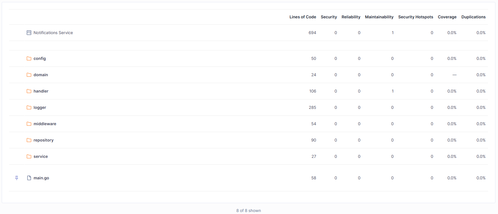

**Summary:** Total **0.0% duplication** (846 lines). All directories (`config`, `domain`, `handler`, `logger`, `middleware`, `repository`, `service`) and `main.go` have 0% duplication. Duplications exist only as duplicated literals (see Issues), not code blocks.

**How to remediate:** Define a constant for the duplicated literal (see Screenshot 2 recommendations).

**How to protect:** Although Duplications is 0%, Issues show that there is a duplicated literal that should be refactored into a constant. Regularly monitor the Issues metric, not just Duplications, especially for security-relevant messages.

---

**Overall summary for notifications-service:**

- **Security:** 0 issues (A) — no direct vulnerabilities.
- **Reliability:** 0 issues (A) — no bugs.
- **Maintainability:** 1 issue (High) — duplicated security error literal in the handler layer.
- **Coverage:** 0.0% — no tests; Quality Gate requires ≥ 80%.
- **Duplications:** 0.0% (Passed) — no duplicated code blocks, but there is a duplicated security-relevant literal.

**Main reason for Quality Gate Passed (with warning):** Low coverage (0% vs required 80%) and 1 Maintainability issue (duplicated security error literal) that should be refactored for better maintainability and consistency in malicious input validation.

---

#### Service 4: **storage-service**

**Dashboard:** `http://localhost:9001/dashboard?id=spotify-storage-service`

**Screenshot 1 — Overview (project summary)**

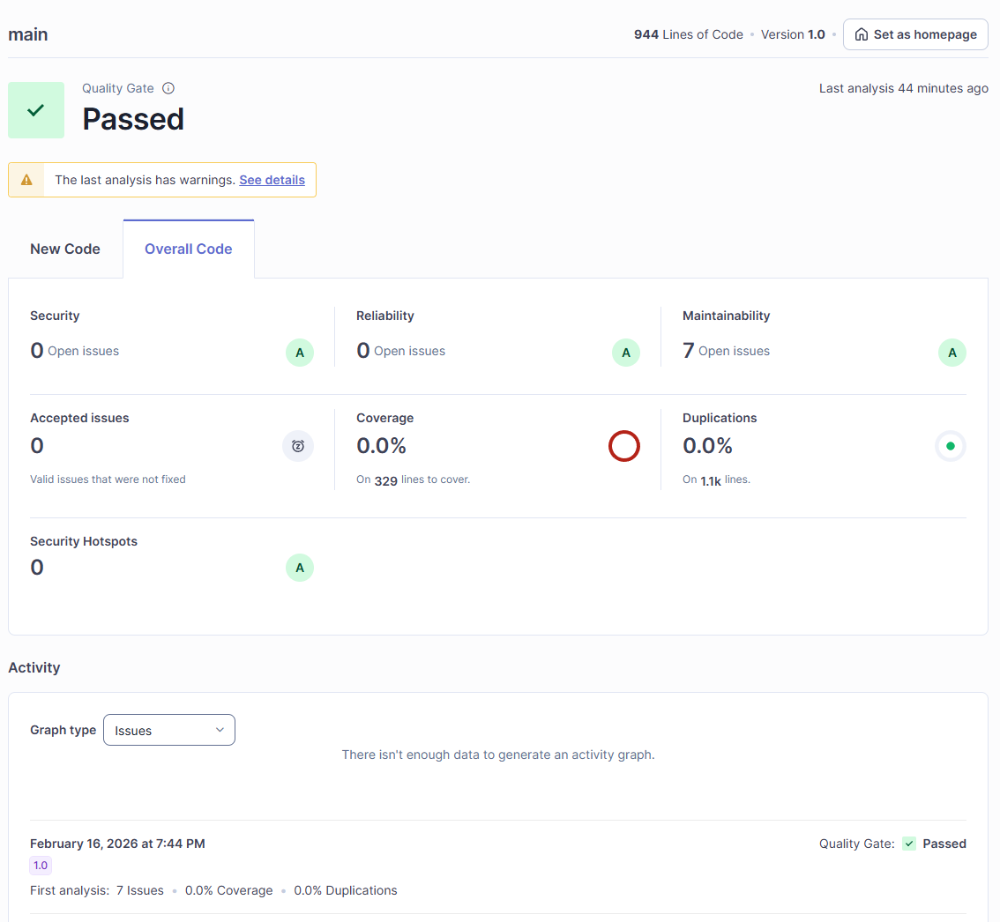

**Summary:** Quality Gate **Passed** (with warning "The last analysis has warnings"). Found: **7 issues** (all Maintainability). Security: 0 issues (A), Reliability: 0 issues (A), Maintainability: 7 issues (A). Coverage: 0.0% (329 lines uncovered), Duplications: 0.0%. Lines of Code: 944.

---

**Screenshot 2 — Issues (identified weaknesses/problems)**

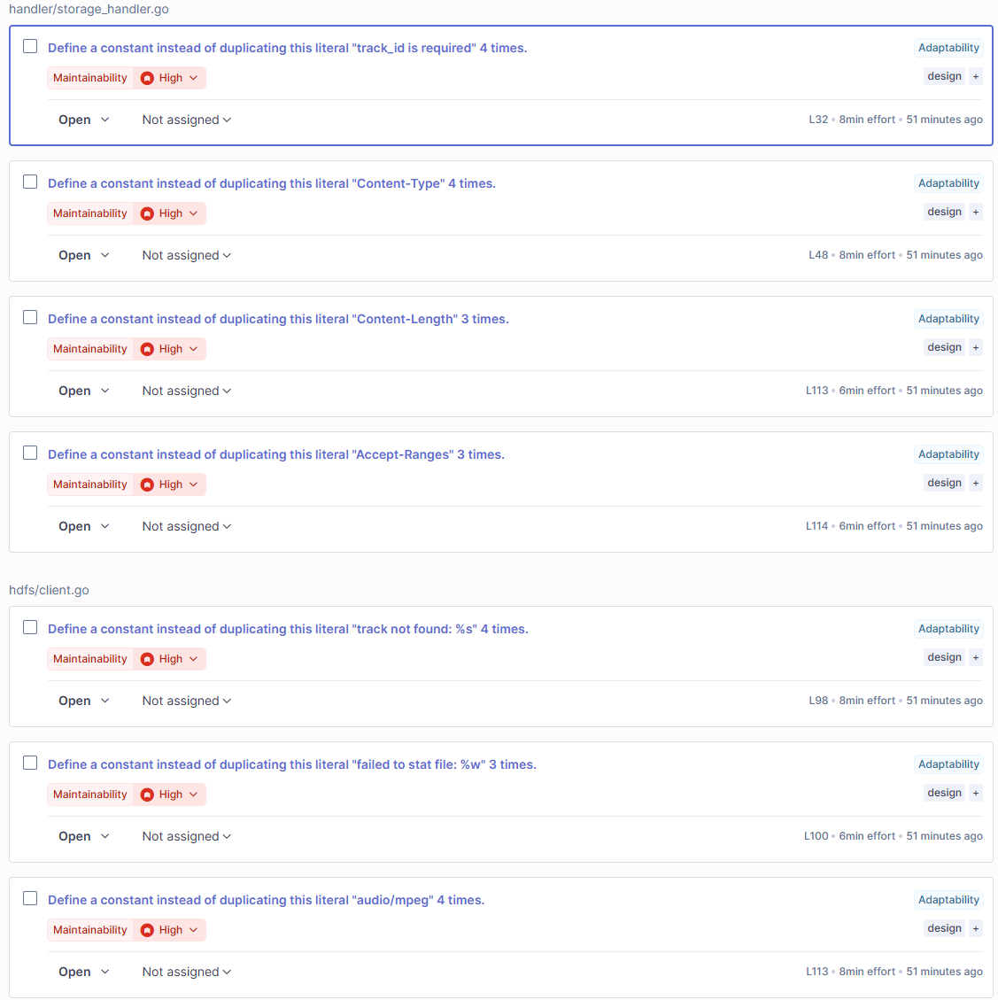

**Identified weaknesses/problems:**

**In `handler/storage_handler.go`:**

1. **Line 32** — Duplicated literal `'track_id is required'` (4 times). Maintainability, High.
2. **Line 48** — Duplicated literal `'Content-Type'` (4 times). Maintainability, High.
3. **Line 113** — Duplicated literal `'Content-Length'` (3 times). Maintainability, High.
4. **Line 114** — Duplicated literal `'Accept-Ranges'` (3 times). Maintainability, High.

**In `hdfs/client.go`:**

5. **Line 98** — Duplicated literal `'track not found: %s'` (4 times). Maintainability, High.
6. **Line 100** — Duplicated literal `'failed to stat file: %w'` (3 times). Maintainability, High.
7. **Line 113** — Duplicated literal `'audio/mpeg'` (4 times). Maintainability, High.

**How they can potentially be exploited:**

- **Duplicated HTTP header literals (`'Content-Type'`, `'Content-Length'`, `'Accept-Ranges'`):** If the header is changed in one place but not another, HTTP responses may become inconsistent. An attacker could exploit inconsistencies to bypass caches or cause unexpected client behavior (for example, a wrong `Content-Type` can facilitate XSS if a file is rendered as HTML instead of being downloaded).
- **Duplicated error messages (`'track not found: %s'`, `'failed to stat file: %w'`):** Inconsistent error messages may reveal information about the system (for example, different messages for different scenarios can reveal whether a file exists, whether the problem is with HDFS, etc.). This can help an attacker in the reconnaissance phase.
- **Duplicated MIME type (`'audio/mpeg'`):** If the MIME type is changed in one place but not another, a file may be served with the wrong `Content-Type`, potentially causing security issues (for example, if an audio file is served as `text/html`, the browser might try to render it).
- **Duplicated validation literal (`'track_id is required'`):** If the message is changed in one place, validation can become inconsistent and allow some endpoints to skip checks.

**How to remediate:**

- **Define constants for HTTP headers:**

```go
// In handler/storage_handler.go
const (
    HeaderContentType   = "Content-Type"
    HeaderContentLength = "Content-Length"
    HeaderAcceptRanges  = "Accept-Ranges"
)
```

- **Define constants for error messages:**

```go
// In hdfs/client.go
const (
    ErrTrackNotFound    = "track not found: %s"
    ErrFailedToStatFile = "failed to stat file: %w"
)
```

- **Define constants for MIME types:**

```go
// In hdfs/client.go or in a separate constants.go
const MIMETypeAudioMPEG = "audio/mpeg"
```

- **Define constants for validation messages:**

```go
// In handler/storage_handler.go
const ErrTrackIDRequired = "track_id is required"
```

- Replace all occurrences of duplicated literals with constants.

**How to protect against exploitation:**

- Run SonarQube scans regularly to detect new duplications, especially in handler and hdfs layers that are critical for file security.
- Focus code review on HTTP headers and MIME types — check that constants are used instead of duplicated literals.
- Test various scenarios (for example different MIME types, different error scenarios) to confirm that messages and headers are consistent.
- Monitor the Quality Gate — even though it is Passed, the warning points to issues that should be fixed.

---

**Screenshot 3 — Security Hotspots**

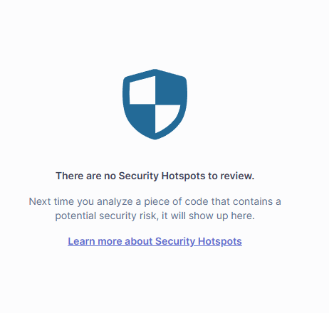

**Summary:** **0 Security Hotspots** — no locations requiring manual review from a security perspective.

---

**Screenshot 4 — Duplications**

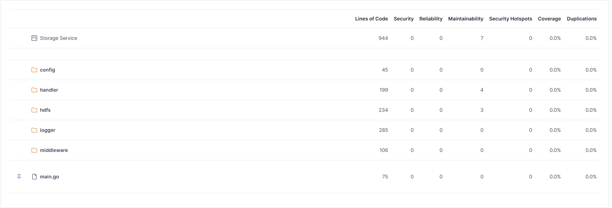

**Summary:** Total **0.0% duplication** (1.1k lines). All directories (`config`, `handler`, `hdfs`, `logger`, `middleware`) and `main.go` have 0% duplication. Duplications exist only as duplicated literals (see Issues), not code blocks.

**How to remediate:** Define constants for duplicated literals (see Screenshot 2 recommendations).

**How to protect:** Although Duplications is 0%, Issues show that there are duplicated literals that should be refactored into constants. Regularly monitor the Issues metric, not just Duplications.

---

**Overall summary for storage-service:**

- **Security:** 0 issues (A) — no direct vulnerabilities.
- **Reliability:** 0 issues (A) — no bugs.
- **Maintainability:** 7 issues (High) — all are duplicated literals in handler and hdfs layers.
- **Coverage:** 0.0% — no tests; Quality Gate requires ≥ 80%.
- **Duplications:** 0.0% (Passed) — no duplicated code blocks, but there are duplicated literals.

**Main reason for Quality Gate Passed (with warning):** Low coverage (0% vs required 80%) and 7 Maintainability issues (duplicated literals) that should be refactored for better maintainability and consistency.

---

#### Service 5: **subscriptions-service**

**Dashboard:** `http://localhost:9001/dashboard?id=spotify-subscriptions-service`

**Screenshot 1 — Overview (project summary)**

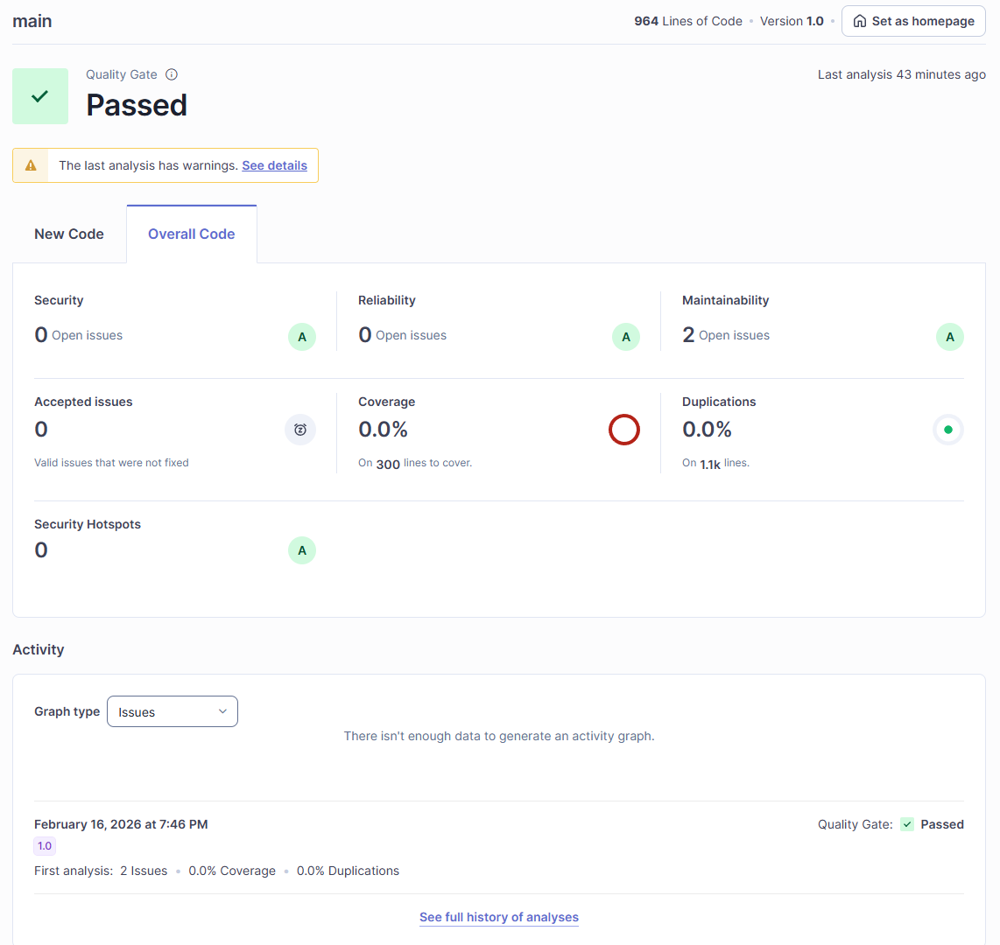

**Summary:** Quality Gate **Passed** (with warning "The last analysis has warnings"). Found: **2 issues** (all Maintainability). Security: 0 issues (A), Reliability: 0 issues (A), Maintainability: 2 issues (A). Coverage: 0.0% (300 lines uncovered), Duplications: 0.0%. Lines of Code: 964.

---

**Screenshot 2 — Issues (identified weaknesses/problems)**

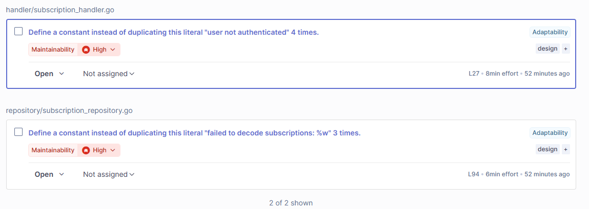

**Identified weaknesses/problems:**

1. **`handler/subscription_handler.go:27`** — Duplicated literal `'user not authenticated'` (4 times). Maintainability, High.
2. **`repository/subscription_repository.go:94`** — Duplicated literal `'failed to decode subscriptions: %w'` (3 times). Maintainability, High.

**How they can potentially be exploited:**

- **Duplicated authentication error literal (`'user not authenticated'`):** If the message is changed in one place but not another, authentication behavior may become inconsistent. An attacker can use different messages to infer where checks are performed and attempt to bypass authentication on certain endpoints. Also, inconsistent messages can hide different error types (for example invalid token vs expired token), making debugging harder and potentially hiding security issues.
- **Duplicated decode error message (`'failed to decode subscriptions: %w'`):** Inconsistent error messages may reveal information about data structure or where in the decode process an error occurs. This can help an attacker in reconnaissance or in crafting malicious payloads that exploit specific parsing errors.

**How to remediate:**

- **Define constants for error messages:**

```go
// In handler/subscription_handler.go
const ErrUserNotAuthenticated = "user not authenticated"

// In repository/subscription_repository.go
const ErrFailedToDecodeSubscriptions = "failed to decode subscriptions: %w"
```

- Replace all occurrences of duplicated literals with constants.
- After the change, rerun the SonarQube scan to confirm the issues are resolved.

**How to protect against exploitation:**

- Run SonarQube scans regularly to detect new duplications, especially in handler and repository layers that are critical for authentication and data processing.
- Focus code review on authentication — check that constants are used instead of duplicated literals for error messages.
- Test different authentication scenarios to confirm that messages are consistent on all endpoints.
- Monitor the Quality Gate — even though it is Passed, the warning points to issues that should be fixed.

---

**Screenshot 3 — Security Hotspots**

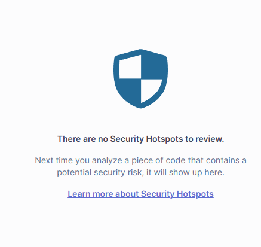

**Summary:** **0 Security Hotspots** — no locations requiring manual review from a security perspective.

---

**Screenshot 4 — Duplications**

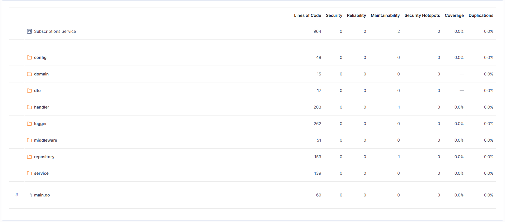

**Summary:** Total **0.0% duplication** (1.1k lines). All directories (`config`, `domain`, `dto`, `handler`, `logger`, `middleware`, `repository`, `service`) and `main.go` have 0% duplication. Duplications exist only as duplicated literals (see Issues), not code blocks.

**How to remediate:** Define constants for duplicated literals (see Screenshot 2 recommendations).

**How to protect:** Although Duplications is 0%, Issues show that there are duplicated literals that should be refactored into constants. Regularly monitor the Issues metric, not just Duplications.

---

**Overall summary for subscriptions-service:**

- **Security:** 0 issues (A) — no direct vulnerabilities.
- **Reliability:** 0 issues (A) — no bugs.
- **Maintainability:** 2 issues (High) — duplicated literals in handler and repository layers.
- **Coverage:** 0.0% — no tests; Quality Gate requires ≥ 80%.
- **Duplications:** 0.0% (Passed) — no duplicated code blocks, but there are duplicated literals.

**Main reason for Quality Gate Passed (with warning):** Low coverage (0% vs required 80%) and 2 Maintainability issues (duplicated literals) that should be refactored for better maintainability and consistency, especially in authentication.

---

### 6.3 Identified Weaknesses and How They Can Be Exploited

Based on the SonarQube analysis of all 5 Go microservices, a total of **20 Maintainability issues** (all High severity) were identified. **There are no direct Security vulnerabilities or Reliability bugs** (all services have an A rating for Security and Reliability). However, Maintainability issues can indirectly affect security and can potentially be exploited.

#### Overall summary of findings per service:

| Service | Security Issues | Reliability Issues | Maintainability Issues | Coverage | Duplications | Security Hotspots |
|--------|----------------|-------------------|------------------------|----------|--------------|------------------|
| **content-service** | 0 (A) | 0 (A) | 4 (High) | 0.0% | 4.25% | 0 |
| **user-service** | 0 (A) | 0 (A) | 6 (High) | 0.0% | 2.9% (handler: 17.1%) | 0 |
| **notifications-service** | 0 (A) | 0 (A) | 1 (High) | 0.0% | 0.0% | 0 |
| **storage-service** | 0 (A) | 0 (A) | 7 (High) | 0.0% | 0.0% | 0 |
| **subscriptions-service** | 0 (A) | 0 (A) | 2 (High) | 0.0% | 0.0% | 0 |
| **TOTAL** | **0** | **0** | **20** | **0.0%** | **0.0% - 4.25%** | **0** |

#### Categories of identified problems:

**1. Duplicated literals (17 issues):**

- **Security-relevant literals:**
  - `"invalid or potentially malicious input detected"` — content-service (5 times), notifications-service (3 times)
  - `"user not authenticated"` — subscriptions-service (4 times)
  - `"user not found"` — user-service (3 times)
  
- **HTTP headers and MIME types:**
  - `"Content-Type"`, `"Content-Length"`, `"Accept-Ranges"` — storage-service (3–4 times each)
  - `"audio/mpeg"` — storage-service (4 times)
  - `"X-User-ID"` — user-service (4 times)
  
- **Validation and error messages:**
  - `"artist id is required"` — content-service (3 times)
  - `"track_id is required"` — storage-service (4 times)
  - `"failed to decode subscriptions: %w"` — subscriptions-service (3 times)
  - `"track not found: %s"`, `"failed to stat file: %w"` — storage-service (3–4 times)
  
- **MongoDB query literals:**
  - `"$options"`, `"$regex"` — content-service (3 times each)

**2. High Cognitive Complexity (4 issues in user-service):**

- `handler/user_handler.go:154` — Complexity 30 (allowed 15)
- `middleware/auth_middleware.go:15` — Complexity 20 (allowed 15)
- `service/user_service.go:426` — Complexity 17 (allowed 15)
- `utils/password_validator.go:8` — Complexity 16 (allowed 15)

#### How they can potentially be exploited:

**1. Duplicated security-relevant literals:**

- **Inconsistent malicious input validation:** If the message `"invalid or potentially malicious input detected"` or its associated logic is changed in one place but not another, an attacker can infer where validation is applied and bypass protection on certain endpoints. If one instance is updated with better validation and others are not, the attacker can exploit the less protected paths.
  
- **Inconsistent authentication/authorization:** Duplicated literals such as `"user not authenticated"` and `"X-User-ID"` in critical handler and middleware layers may lead to authorization bypass if a header or message is changed in one place but not others. An attacker can exploit inconsistent validation on certain endpoints.

- **Information leakage via error messages:** Inconsistent error messages (`"user not found"`, `"track not found"`, `"failed to decode subscriptions"`) can reveal information about the system (for example, different messages for different scenarios can reveal whether a resource exists, whether the problem is with the database, etc.). This can help an attacker in reconnaissance or in crafting malicious payloads.

**2. Duplicated HTTP headers and MIME types:**

- **Inconsistent HTTP responses:** If a header (`"Content-Type"`, `"Content-Length"`, `"Accept-Ranges"`) is changed in one place but not another, HTTP responses can become inconsistent. An attacker can exploit these inconsistencies to bypass caches or cause unexpected client behavior (for example, a wrong `Content-Type` can lead to XSS if a file is rendered as HTML).

- **MIME type confusion:** If the MIME type (`"audio/mpeg"`) is changed in one place but not another, files can be served with incorrect `Content-Type`, leading to security problems (for example, audio served as `text/html`).

**3. High Cognitive Complexity:**

- **Logic errors in critical functions:** Complex functions (Complexity > 15) are harder to understand and maintain, increasing the probability of errors. In `user_handler.go:154` (Complexity 30) and `auth_middleware.go:15` (Complexity 20) — critical authentication points — high complexity can hide logic errors that an attacker could exploit (for example missing checks, wrong authorization logic, uncovered edge cases).

- **Difficult code review:** High complexity makes code review harder and increases the likelihood of missed security issues. Attackers can exploit edge cases that were not detected during review.

**4. Low code coverage (0.0% in all services):**

- **Undetected regressions:** Without tests, code changes can introduce new vulnerabilities that remain unnoticed. Attackers can exploit regressions introduced during refactoring or new feature development.

- **Uncovered edge cases:** Without tests, edge cases (for example boundary values, null pointer dereferences, race conditions) may remain undetected and exploitable.

**5. High duplication percentage (especially in user-service handler directory — 17.1%):**

- **Propagation of errors:** If a bug is introduced in duplicated code, it propagates to every location that uses that code. Attackers can exploit the same bug across all duplicated instances.

- **Maintenance difficulties:** High duplication makes maintenance and refactoring more difficult, increasing the probability of introducing new vulnerabilities during changes.

---

### 6.4 How to Remediate the Identified Weaknesses

Based on SonarQube Issues and Security Hotspots analysis, here are concrete remediation recommendations:

#### 1. Refactor Duplicated Literals into Constants

**Priority: HIGH** — affects 17 of 20 issues.

**For each service, create centralized constants:**

**content-service:**

```go
// In handler/content_handler.go or a dedicated constants.go
const (
    ErrArtistIDRequired = "artist id is required"
    ErrInvalidInput     = "invalid or potentially malicious input detected"
)

// In repository/content_repository.go
const (
    MongoOptionKey = "$options"
    MongoRegexKey  = "$regex"
)
```

**user-service:**

```go
// In handler/user_handler.go
const HeaderXUserID = "X-User-ID"

// In service/user_service.go
const ErrUserNotFound = "user not found"
```

**notifications-service:**

```go
// In handler/notification_handler.go or a dedicated security/constants.go
const ErrInvalidMaliciousInput = "invalid or potentially malicious input detected"
```

**storage-service:**

```go
// In handler/storage_handler.go
const (
    ErrTrackIDRequired   = "track_id is required"
    HeaderContentType    = "Content-Type"
    HeaderContentLength  = "Content-Length"
    HeaderAcceptRanges   = "Accept-Ranges"
)

// In hdfs/client.go
const (
    ErrTrackNotFound    = "track not found: %s"
    ErrFailedToStatFile = "failed to stat file: %w"
    MIMETypeAudioMPEG   = "audio/mpeg"
)
```

**subscriptions-service:**

```go
// In handler/subscription_handler.go
const ErrUserNotAuthenticated = "user not authenticated"

// In repository/subscription_repository.go
const ErrFailedToDecodeSubscriptions = "failed to decode subscriptions: %w"
```

**Actions:**

- Replace all occurrences of duplicated literals with constants.
- Consider creating a centralized security error handling module that uses constants and provides consistent logging and responses for all malicious input cases.
- After changes, rerun the SonarQube scan to confirm that issues are resolved.

#### 2. Reduce Cognitive Complexity

**Priority: HIGH** — affects 4 issues in user-service (critical auth functions).

**Refactor complex functions:**

**`handler/user_handler.go:154` (Complexity 30):**

- Split the function into smaller functions with clear responsibilities.
- Extract common parts into helper functions.
- Use early returns to reduce nesting.

**`middleware/auth_middleware.go:15` (Complexity 20):**

- Extract token validation into a separate function.
- Extract authorization checks into a separate function.
- Consider using a strategy pattern for different authentication types.

**`service/user_service.go:426` (Complexity 17):**

- Split the function into smaller units.
- Extract validation and business logic into separate functions.

**`utils/password_validator.go:8` (Complexity 16):**

- Split password validation into smaller functions (for example `validateLength`, `validateComplexity`, `validateCommonPasswords`).

**Actions:**

- Refactor functions to keep Complexity ≤ 15.
- Add unit tests for refactored functions to ensure functionality is preserved.
- After changes, rerun the SonarQube scan to confirm issues are resolved.

#### 3. Add Code Coverage Tests

**Priority: CRITICAL** — currently 0.0% coverage across all services; Quality Gate requires ≥ 80%.

**Test plan:**

**Phase 1 — Unit tests for critical functions:**

- Authentication/authorization (user-service, subscriptions-service)
- Input validation (content-service, notifications-service)
- File handling (storage-service)
- Password validation (user-service)

**Phase 2 — Integration tests:**

- API endpoints (all services)
- Database operations (all services)
- External service calls (for example HDFS in storage-service)

**Phase 3 — End-to-end tests:**

- Complete user flows
- Cross-service communication

**Actions:**

- Create `*_test.go` files for each module.
- Use the Go `testing` package and mocking libraries (for example `testify/mock`).
- Integrate tests into the CI/CD pipeline so they run automatically before merges.
- Set a coverage threshold (for example 80%) in the SonarQube Quality Gate.
- After adding tests, rerun the SonarQube scan to confirm coverage has increased.

#### 4. Reduce Code Duplication

**Priority: MEDIUM** — especially critical for user-service `handler` directory (17.1% duplication).

**Duplication reduction strategy:**

**user-service handler directory:**

- Extract common parts into helper functions or middleware.
- Use generic functions for repeated operations (for example error handling, response formatting).
- Refactor duplicated code blocks into reusable components.

**content-service:**

- Refactor duplications in `content_handler.go` (13.3% duplication) — extract common parts into functions or constants.

**Actions:**

- Identify duplicated code blocks via the SonarQube Duplications tab.
- Refactor duplicated code into reusable components.
- After changes, rerun the SonarQube scan to confirm duplications have decreased.

#### 5. Monitoring and Maintenance

**Actions:**

- Run SonarQube scans regularly (for example before each merge or daily).
- Monitor the Quality Gate — block merges if the Quality Gate fails.
- Focus code review on:
  - Duplicated literals (especially security-relevant ones)
  - Cognitive Complexity (especially for critical functions)
  - Code coverage (ensure new code has tests)
- Automation: integrate SonarQube into the CI/CD pipeline to automatically check the Quality Gate and block merges if it fails.

---

### 6.5 How to Protect Against Exploitation

Protecting against exploitation of identified weaknesses requires a combination of **preventive measures** (SonarQube scans, code review, tests) and **reactive measures** (monitoring, incident response), tied to the controls described in Sections 1–6.

#### 1. Preventive Measures — SonarQube Integration

**Regular SonarQube scans:**

- **Before merge:** Automatically run SonarQube scans for each pull request. Block merges if the Quality Gate fails or if new Security/Reliability issues are introduced.
- **Daily/weekly:** Run scans for all services to detect issues that may have been missed during development.
- **Before release:** Run scans before each release and ensure all critical issues are resolved.

**Monitoring the Quality Gate:**

- **Configure Quality Gate criteria:**
  - Security: 0 issues (Critical, High, Medium)
  - Reliability: 0 issues (Critical, High)
  - Maintainability: ≤ 10 High severity issues — currently 20, with a goal to reduce to ≤ 10
  - Coverage: ≥ 80% — currently 0%, with a goal to increase gradually
  - Duplications: ≤ 3% — currently 0–4.25%, ensure it does not exceed 3%
- **Block merges if the Quality Gate fails:** Integrate SonarQube into CI/CD (for example GitHub Actions, GitLab CI) to automatically check the Quality Gate and block merges if it does not pass.

#### 2. Preventive Measures — Development and Testing

**Adding tests for higher coverage:**

- **Unit tests:** Cover critical functions (authentication, validation, file handling). Target: ≥ 80% coverage in all services.
- **Integration tests:** Cover API endpoints and database operations.
- **Security tests:** Add tests for edge cases (malicious input, invalid tokens, unauthorized access) to ensure vulnerabilities are not introduced during refactoring.

**Reducing duplications:**

- **Refactor duplicated blocks:** Use the SonarQube Duplications tab to identify duplicated code and refactor it into reusable components.
- **Monitor Duplications metric:** Regularly monitor Duplications per directory; user-service handler directory (17.1%) is especially critical.

#### 3. Reactive Measures — Monitoring and Incident Response

**Centralized logging and monitoring:**

- **Integrate with the logging system (see Section 5 — Security Roadmap):** Centralize logs from all services into a single store (for example ELK, Loki, SIEM) to support detection, alerting and incident response.
- **Log security-relevant events:**
  - Authentication errors (for example `"user not authenticated"`, invalid tokens)
  - Input validation errors (for example `"invalid or potentially malicious input detected"`)
  - Authorization errors (for example unauthorized access attempts)
  - Rate limit hits (DoS mitigation)
- **Alerting:** Configure alerts for:
  - Unusual authentication failures (for example more than X failed attempts in a short period)
  - Detection of malicious input (for example SQL injection, XSS patterns)
  - Unauthorized access attempts (for example attempts to reach admin endpoints)

**Incident response:**

- **Incident response procedure:** Define a process for handling security incidents (for example detection of vulnerabilities, exploitation, false positives).
- **Link to SonarQube findings:** If exploitation of an issue detected by SonarQube is observed, prioritize fixing that issue.

#### 4. Authentication and Authorization

- **JWT validation:** Ensure JWT validation is performed consistently on all endpoints (refactor duplicated literals such as `"X-User-ID"`, `"user not authenticated"` into constants).
- **RBAC enforcement:** Ensure RBAC checks are enforced consistently (refactor high Complexity functions in auth middleware and handler layers).

#### 5. Input Validation

- **Consistent malicious input validation:** Ensure malicious input validation is performed consistently on all endpoints (refactor duplicated literals such as `"invalid or potentially malicious input detected"` into constants).
- **XSS and SQL injection protection:** Ensure XSS and SQL injection pattern checks are applied consistently (add tests to ensure vulnerabilities are not introduced during refactoring).

#### 6. DoS Mitigation

- **Rate limiting:** Ensure rate limiting is consistently applied to all relevant endpoints (add tests for rate-limiting scenarios).

